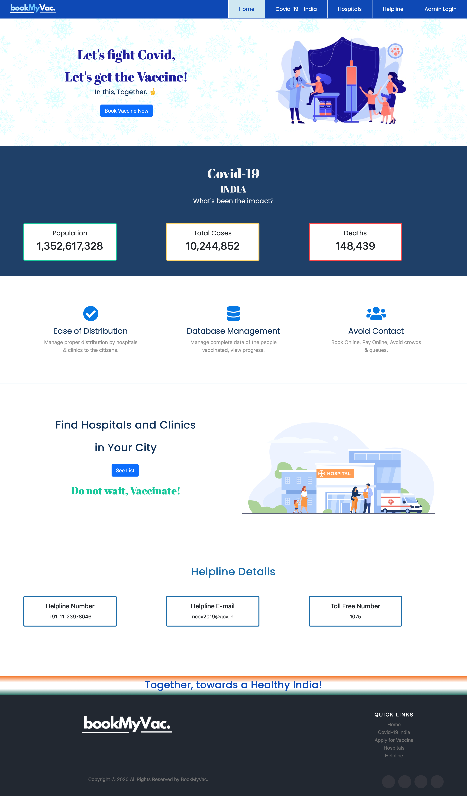

# Introduction
BookMyVac. , is a web-based platform to connect users directly with nearby hospitals and facilitate the process of scheduling an appointment with the hospital to get vaccinated.

Using our platform, the user has to fill a registration form providing necessary details which will be shared to the hospital. Then, the user can choose from available date and time slots, make an online payment. Later, the user can visit the chosen hospital according to the scheduled appointment.

Why our platform?

  1.Proper Management of Vaccine Distribution.
  
  2.Database of all vaccinated people.
  
  3.Reducing possible crowding at clinics/ hospitals when the vaccine becomes public.

On the admin side, proper database of users and hospitals will be maintained to track the progress and maintain the records of vaccine distribution easily and efficiently.

# Installation Process

1. Download the source code

2. Using command line, change the current directory to the downloaded project directory using cd "downloaded-folder-path"

3. Now, run node app.js in the same CLI.
  It should display: "server started on port:3000"
  
4. Open any web browser go to "localhost:3000"

## Accessing admin side

Enter the credentials:

Email: admin@abc.com

Password: 1234

